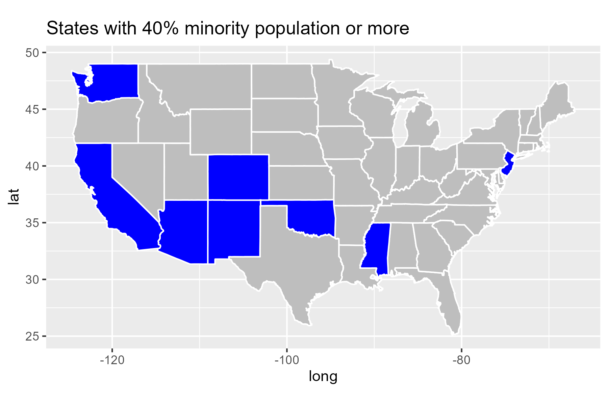
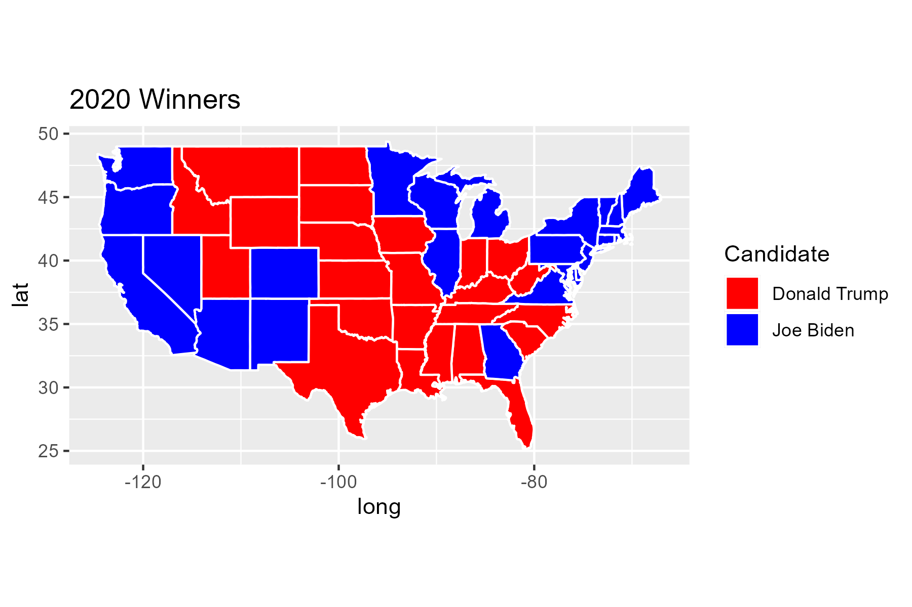

# Analyzing Voter Behavior in the 2020 US Election
## Introduction
This project aims to analyze voter behavior in the 2020 US presidential election using statistical methods. The goal is to predict which candidate is more likely to win in which state based on various demographic and socio-economic factors.
## EDA
The data used in this project is publicly available from the United States Census Bureau and the MIT Election Data and Science Lab. We used the data from the 2020 US presidential election, which includes demographic and socio-economic factors for each county in the United States. We explored the properties of both datasets, and aggregated them. We then took an initial look at all potential candidates in the election before narrowing our scope down to just Donald Trump and Joe Biden. We initially found that states with high presence of racial minorities were more likely to vote for Biden. 

    
    

## Methods
We used both classification and regression methods to analyze the data. Our regression method used total votes as the response variable and various predictor variables to predict the number of votes each candidate would receive. Our classification methods compared both candidates at once to predict which candidate would win in each state. 

## Conclusion
Our analysis showed that classification methods were better suited for predicting which candidate would win in each state. We found that demographic factors such as race, education, and profession were the biggest influencers on election results. However, we also found that the "Transit" variable had a higher influence than expected in our tree models. We believe this is due to its correlation with urban areas, which tend to be more diverse and liberal.

In conclusion, we recommend using classification methods with demographic and socio-economic factors to predict which candidate will win in each state in future elections.
