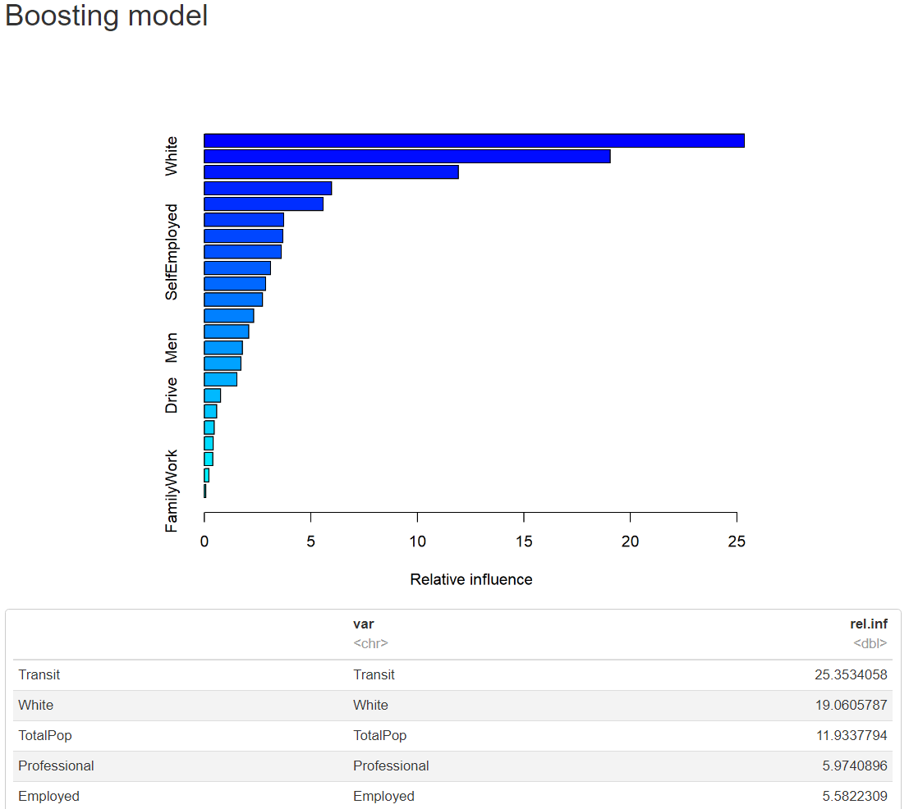

# Analyzing Voter Behavior in the 2020 US Election
## Introduction
This project aims to analyze voter behavior in the 2020 US presidential election using statistical methods. The goal is to predict which candidate is more likely to win in which state based on various demographic and socio-economic factors.
## EDA
The data used in this project is publicly available from the United States Census Bureau and the MIT Election Data and Science Lab. We used the data from the 2020 US presidential election, which includes demographic and socio-economic factors for each county in the United States. We explored the properties of both datasets, and aggregated them. We then took an initial look at all potential candidates in the election before narrowing our scope down to just Donald Trump and Joe Biden. We initially found that states with high presence of racial minorities were more likely to vote for Biden. 

  
  

## Methods
We used both classification and regression methods to analyze the data. Our regression method used total votes as the response variable and various predictor variables to predict the number of votes each candidate would receive. Our classification methods compared both candidates at once to predict which candidate would win in each state. Our initial Tree and Logarithmic models outperformed our LASSO model, so we moved forward to a more powerful classification model.

Our boosting model found our most predictive variables to be 'Transit', 'White', 'TotalPop', 'Professional', and 'Employed' on voter behavior.

## Conclusion
Our analysis leans towards classification methods over regression, focusing on predicting which candidate will win in each state rather than solely examining total votes. This shift addresses the core question of candidate comparison, recognizing the influence of predictors like total population as a reflection of overall voting potential rather than candidate preference. Concerns arise regarding the disproportionate influence of the "Transit" variable in our models, contrasting with the emphasis on demographics by reputable sources like the Washington Post. Conversely, predictors such as racial demographics, total population, and professional fields exhibit logical and significant influence, aligning with past election trends and analytical insights regarding voting behavior.
